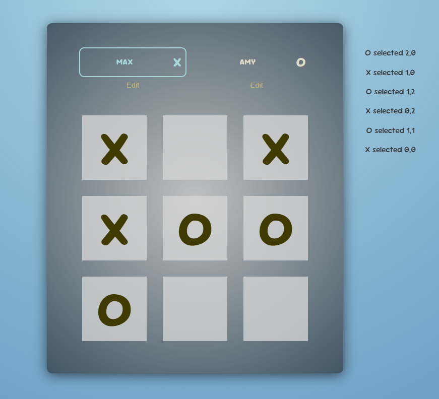
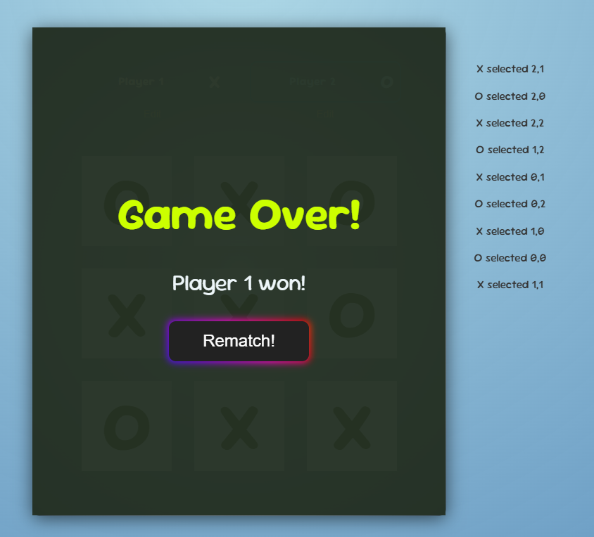

# Tactic Tac Toe 🎮

**[Tactic Tac Toe](https://halil-yesilyurt.github.io/tactic-tac-toe/)** is a classic tic-tac-toe game built using **React.js** and **Vite** for fast development, with **CSS** for styling. This simple, interactive game lets players edit their names and tracks game logs next to the board, providing an engaging experience for users of all ages.

## Features

- **Two-Player Game:** Supports two players, taking turns with "X" and "O".
- **Player Name Customization:** Players can edit their names before starting the game or even during gameplay.
- **Move Logs:** Every move made by a player is logged next to the game board.
- **Game Over & Draw:** The game automatically checks for a winner. If all spaces are filled and there is no winner, the game ends with a draw message.
- **Rematch Option:** Players can start a new game (rematch) to play again after the game is completed.

<p align="center">
    
</p>

## Getting Started

Follow these instructions to get a local copy of the project up and running.

### Prerequisites

Make sure you have the following installed:

- [Node.js](https://nodejs.org/)
- [Git](https://git-scm.com/)

### Installation

1. Clone the repository:

```bash
git clone https://github.com/halil-yesilyurt/tactic-tac-toe.git
```

2. Navigate to the project directory:

```bash
cd tactic-tac-toe
```

3. Install the dependencies:

```bash
npm install
```

4. Start the development server:

```bash
npm run dev
```

5. Open the game in your browser:

```plaintext
http://localhost:3000
```

### Usage

1. Enter Player Names: Before starting, you can enter names for Player-1 and Player-2.

2. Play the Game: Take turns clicking on squares on the 3x3 grid to place your marker.

3. View Logs: Each move is recorded in a log beside the board, showing the sequence of moves.

4. Winning or Drawing: The game will automatically detect if there's a winner or if it ends in a draw.

5. Rematch: You can start a new game (rematch) to play again after the game is completed.

<p align="center">
    
</p>

### Technologies Used

- Vite - Fast development environment for modern JavaScript frameworks
- React.js - JavaScript library for building user interfaces
- CSS - Styling for a simple and clean user interface

### Contributing

If you want to contribute to Tactic Tac Toe, feel free to fork the repository and submit a pull request. All contributions are welcome!

### License

This project is open-source and available under the MIT License.

### Acknowledgements

Thanks to the open-source community for inspiring and providing tools to make projects like this possible.
